# AssetTracker 使用教學

> 你好！這份教學會一步一步帶你完成 AssetTracker 的安裝與常用操作，不需要任何技術背景。  
> 有任何問題，歡迎直接問我。

---

## 目錄

1. [安裝與開始使用](#1-安裝與開始使用)
2. [新增第一筆資產](#2-新增第一筆資產)
3. [雲端備份：Google Sheets 同步](#3-雲端備份google-sheets-同步)
4. [賣出與損益記錄](#4-賣出與損益記錄)
5. [績效分析](#5-績效分析)
6. [資產配置圖表（統計頁籤）](#6-資產配置圖表統計頁籤)
7. [資產走勢圖（趨勢頁籤）](#7-資產走勢圖趨勢頁籤)
8. [設定：交易所 API 同步](#8-設定交易所-api-同步)
9. [最新財經新聞（新聞頁籤）](#9-最新財經新聞新聞頁籤)

---

## 1. 安裝與開始使用

### 開啟 App

用手機瀏覽器打開以下網址，你會看到登入畫面：

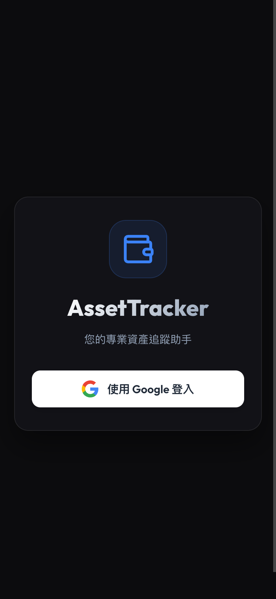

點「**使用 Google 登入**」，選擇你的 Google 帳號並授權，就會進入 App 主畫面。

---

### iPhone 安裝到主畫面（可選）

把 App 加入主畫面後，用起來就跟一般 App 一樣，不需要每次開瀏覽器。

> **注意：** iPhone 必須用 **Safari** 才能加入主畫面，其他瀏覽器（Chrome、Firefox）沒有這個選項。

1. 用 Safari 開啟 App 網址
2. 點畫面底部的 **分享按鈕**（方形加箭頭的圖示）
3. 向下滑，找到「**加入主畫面**」
4. 點「**新增**」，完成！

---

### Android 安裝到主畫面（可選）

1. 用 Chrome 開啟 App 網址
2. 畫面底部或網址列旁會出現「**安裝 App**」的提示橫幅，點選它
3. 確認安裝後，App 圖示就會出現在主畫面

---

### 第一次開啟後的畫面

登入後，你會看到空白的資產列表。頁面頂部顯示「**總資產估值 $0**」，右下角有藍色的「**＋**」按鈕可以新增第一筆資產。

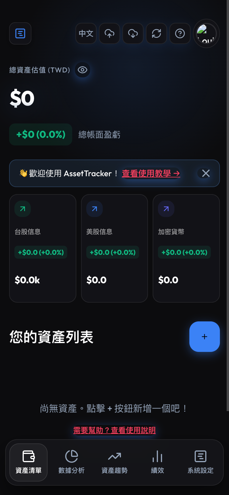

---

## 2. 新增第一筆資產

### 點選「＋」新增資產

點畫面右下角的藍色「**＋**」按鈕，就會彈出新增資產的視窗。

---

### 填寫資產資料

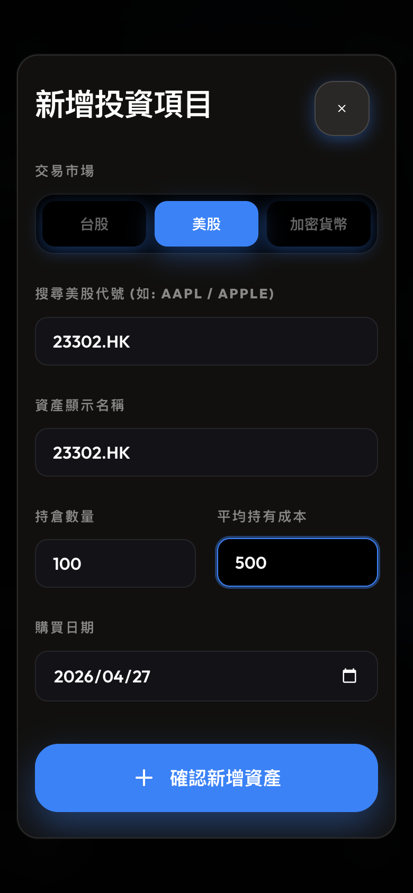

各欄位說明：

- **市場**：選擇你的資產類型
  - `台股` — 台灣上市股票（例如台積電、台達電）
  - `美股` — 美國股票（例如 Apple、NVIDIA）
  - `加密貨幣` — 比特幣、以太坊等

- **股票代號**：
  - 台股填數字代碼，例如 **2330**（台積電）
  - 美股填英文代號，例如 **AAPL**（Apple）
  - 加密貨幣填 **BTC**、**ETH** 等

- **成本價**：你**買入時的每股價格**，不是現在的市價。例如你以每股 $500 買進台積電，就填 500。

- **持有數量**：你買了幾股（或幾個單位）。

填完後按「**新增**」。

---

### 新增成功後的畫面

資產新增後，頁面頂部會顯示你的**總持倉價值**和**損益概覽**。

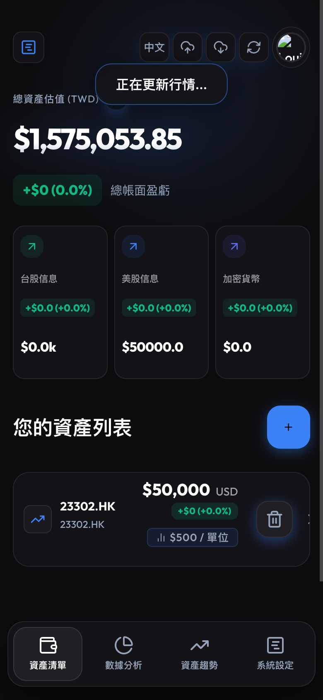

**接下來可以做什麼？**

- 點選任何一筆資產，可以展開查看詳細資訊
- 點頂部的「**重新整理**」圖示（循環箭頭），會自動抓取最新股價
- 頁面頂部會即時更新「總資產估值」和「損益」

---

## 3. 雲端備份：Google Sheets 同步

### 為什麼需要備份？

你的資產資料預設儲存在手機本地端。如果**換了新手機**或**清除瀏覽器資料**，資料就會消失。  
透過 Google Sheets 同步，資料會備份到你的 Google 雲端硬碟，隨時可以還原。

> **前提**：手機上需要已登入 Google 帳號（大多數手機預設都已登入）。

---

### 備份到雲端

點頁面右上角的「**雲端上傳**」圖示（向上的雲朵）：

第一次點選時，會跳出 **Google 授權視窗**，選擇你的帳號並點「**允許**」。  
授權完成後，App 會自動在你的 Google 雲端硬碟建立一個試算表，並將資產資料存入。

---

### 常見問題：授權彈窗被封鎖

有些情況下授權視窗無法彈出：

- **手機 PWA 模式**（已加入主畫面）：改用 Safari 或 Chrome 的**普通瀏覽器分頁**開啟 App，再重新點備份。
- **電腦瀏覽器**：點網址列右方的「**彈出視窗被封鎖**」圖示，選擇「**永遠允許**」，再重試。

---

### 常見問題：授權失敗或不小心拒絕

不用擔心，**本機資料不會消失**，你的資產列表仍然完整保留。  
稍後再點備份按鈕重試即可。如果反覆失敗，建議登出 Google 帳號後重新嘗試。

---

### 從雲端還原

換新手機或清除瀏覽器資料後，重新登入 App，再點「**雲端下載**」圖示（向下的雲朵）即可還原：

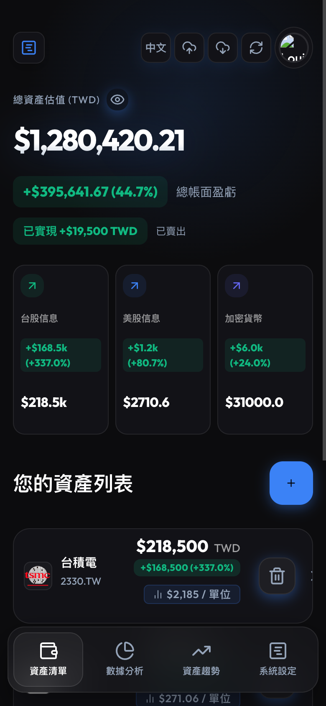

---

## 4. 賣出與損益記錄

### 找到賣出按鈕

在資產列表中，點選任意一筆資產，展開後可以看到每筆購買記錄，以及右側的橘色「**賣**」按鈕：

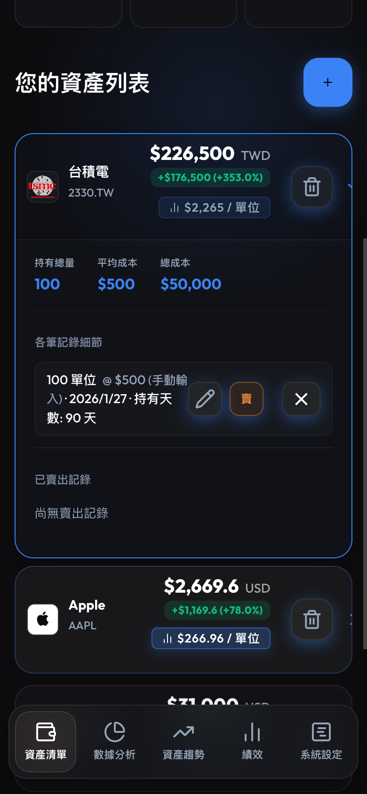

---

### 填寫賣出資料

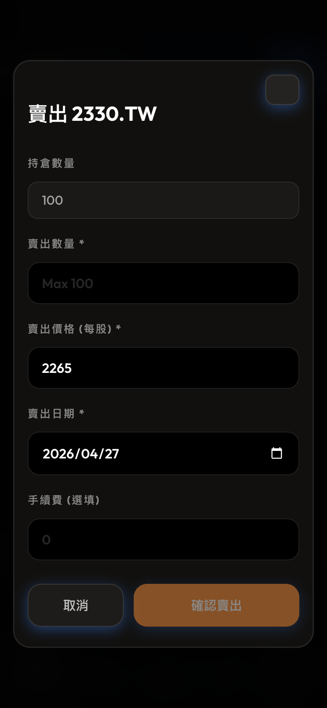

- **賣出數量**：這次要賣幾股，不超過持倉數量即可
- **賣出價格（每股）**：你的實際成交價
- **賣出日期**：預設為今天，也可以改成過去的日期（補登記錄）
- **手續費**（選填）：如有交易手續費可填入，會影響損益計算

填入後，下方會即時顯示**預估損益**，確認無誤後按「**確認賣出**」。

---

### 已平倉（完全賣出的資產）

當一筆資產的所有持股都賣出後，它會從「你的資產列表」移到下方的「**已平倉**」區段，方便你查看歷史交易記錄：

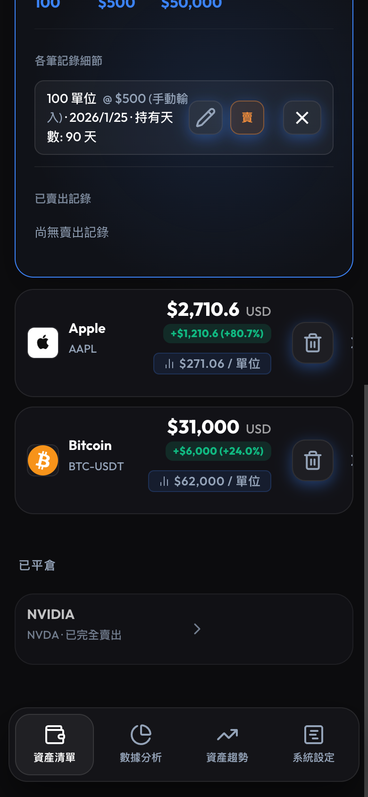

點選已平倉的項目，可以展開查看每一筆賣出的詳細損益。

---

## 5. 績效分析

### 開啟績效頁籤

在主畫面底部導覽列點選「**績效**」頁籤，即可進入投資組合績效總覽。

### 年化報酬率 (CAGR)

頁面頂部顯示整個投資組合的**市值加權年化報酬率**，以及從最早持倉日起算的**持有天數**。  
未設定購買日期的資產會被排除計算，並以提示說明排除筆數。

> 如果有資產尚未填寫購買日期，頁面會出現**批次設定面板**，讓你一次補齊所有日期後統一儲存。

### 基準比較

頁面同時顯示你的 CAGR 與以下兩個指數在同期間的表現比較：

- **TAIEX (^TWII)**：台灣加權股價指數
- **S&P 500 (SPY)**：美國標普 500

每個基準旁會標示「**Beating**」（贏過）或「**Lagging**」（落後），以及差距的百分點數。

### 各資產績效排行

頁面下方列出每檔資產的個別 CAGR，從最高到最低排序，同時顯示未實現損益，讓你快速找出最佳與最差表現的持倉。  
若同一檔股票有多筆買入紀錄（分批建倉），系統會自動合併為一列，以**市值加權平均**呈現該檔整體 CAGR 與合計損益。

---

## 6. 資產配置圖表（統計頁籤）

### 開啟統計頁籤

在底部導覽列點選「**統計**」（圓餅圖圖示），可以看到投資組合的配置比例圖表。

### 兩種檢視模式

頁面右上角有兩個切換按鈕：

- **按市場類型**：整個投資組合按市場（台股 / 美股 / 加密貨幣）分成三塊，讓你一眼看出各市場占比。
- **按資產種類**：每一檔個股或加密貨幣獨立顯示為一個扇形，顏色以市場區分（台股藍色、美股綠色、加密貨幣琥珀色）。

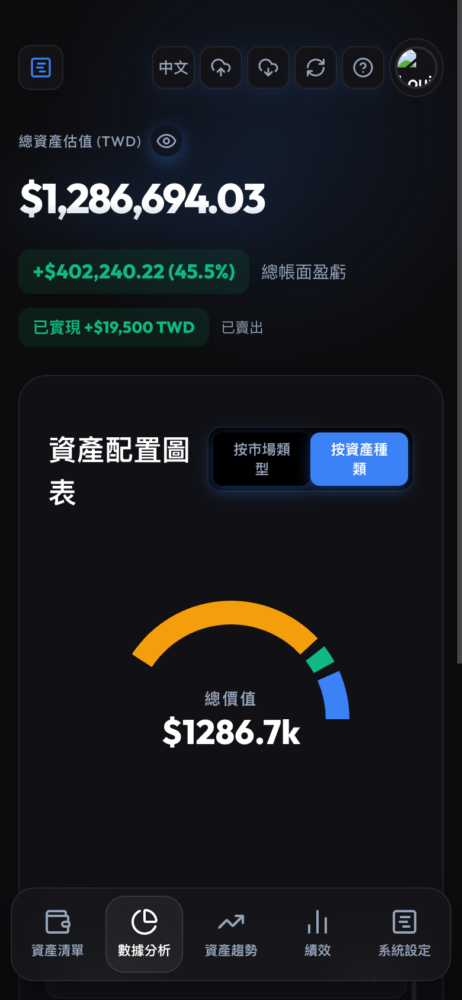

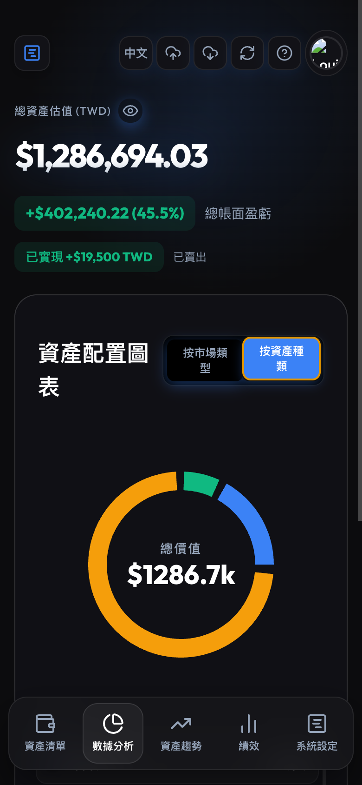

### 圖表說明

- 圓環中央顯示**投資組合總市值**（以 k 為單位）
- 圖例列在圓環下方，「按資產種類」模式會依市場分組顯示，並列出每檔資產占總資產的百分比
- 滑鼠移到（或點按）扇形時，會彈出提示框顯示該項目的**市值金額**

---

## 7. 資產走勢圖（趨勢頁籤）

### 開啟趨勢頁籤

在底部導覽列點選「**趨勢**」（折線箭頭圖示），可以查看投資組合隨時間的歷史走勢。

> **注意**：走勢圖需要歷史快照資料，App 每天會自動記錄一次當天的總市值。第一天使用時圖表可能只有一個點，隨著使用天數累積，曲線會越來越完整。

### 時間區間選擇

圖表上方有五個時間按鈕：**1W**（近一週）、**1M**（近一個月）、**3M**（近三個月）、**1Y**（近一年）、**MAX**（全部）。點選後圖表會自動縮放到對應區間。

### 顯示模式

右側有兩個切換按鈕：

- **總值**：Y 軸顯示每日投資組合的絕對市值
- **損益%**：Y 軸改為以百分比顯示相對損益，方便和基準比較

### 歷史記錄與備註

圖表下方列出最近 15 筆快照，每筆顯示**日期**、**市值**、以及與前一天的**漲跌金額和百分比**。  
點選每筆記錄右側的「**+ 新增備註**」，可以替那天寫下一句備忘（例如「加倉台積電」），備註儲存後會直接顯示在該筆記錄上。

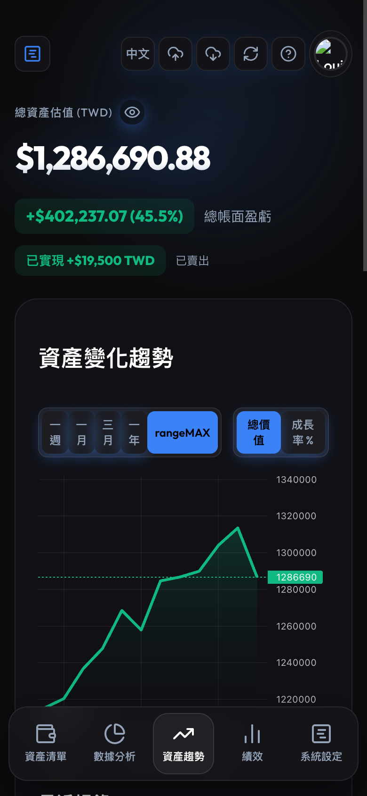

---

## 8. 設定：交易所 API 同步

### 開啟設定頁籤

在底部導覽列點選「**設定**」（格線圖示），可以管理交易所 API 金鑰。

### 支援的交易所

目前支援自動同步餘額的交易所：

- **Pionex**（派網）
- **BitoPro**（幣託）

### 新增 API 金鑰

1. 前往交易所官網，在帳號設定中建立一組「**唯讀**」API 金鑰（只需讀取權限，不要開啟提款或交易權限）
2. 在 App 設定頁面，從下拉選單選擇交易所名稱
3. 依序填入「**API Key**」和「**API Secret**」
4. 點「**新增交易所**」

### 同步餘額

新增完成後，交易所卡片會顯示在頁面上，包含上次同步時間和交易所總市值。  
點卡片右側的「**重新整理**」按鈕（循環箭頭），即可手動觸發一次餘額同步，把最新持倉自動帶入資產列表。

### 刪除 API 金鑰

點卡片右側的「**垃圾桶**」圖示，確認後即可移除該交易所設定。刪除後該交易所同步的資產不會自動消失，需要手動從資產列表刪除。

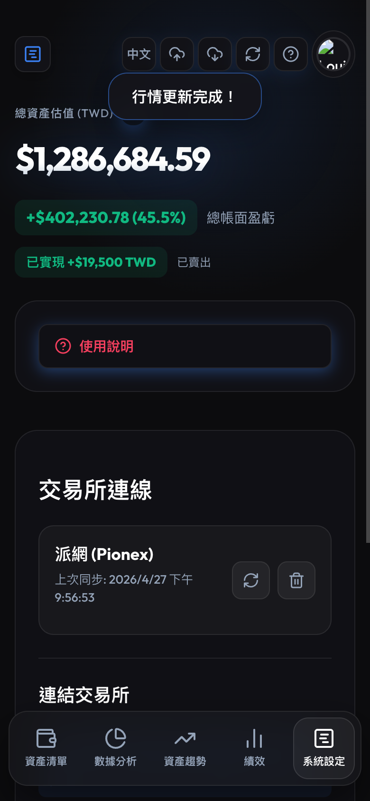

---

## 9. 最新財經新聞（新聞頁籤）

### 功能說明

「新聞」頁籤會自動顯示你持股**市值前 10 大標的**的最新財經新聞。每張卡片顯示：

- **標的代號**（例：NVDA、2330.TW）
- **文章標題**（可點選開啟原始報導）
- **來源媒體**（例：Reuters、Bloomberg）
- **發布時間**（例：2h ago、3d ago）

---

### 前提條件

> **重要**：新聞功能需要設定 **Cloudflare Worker 代理**（`VITE_CORS_PROXY_URL`）才能使用。  
> 若尚未設定，頁籤會顯示設定說明的提示訊息。  
> 設定方式請參考 [docs/cloudflare-worker-setup.md](./cloudflare-worker-setup.md)。

---

### 使用方式

1. 點選頁面底部的「**新聞**」頁籤（報紙圖示）。
2. App 會自動依持倉市值由高至低，載入前 10 檔標的的最新新聞。
3. 點選任一文章標題，即可在瀏覽器新分頁開啟原始報導。

> **提示**：新聞資料快取 15 分鐘。切換頁面後回來，或重新整理市價後，快取會自動刷新。加密貨幣代號（例：BTC-USD）會自動去除幣種後綴後再查詢，BRK-A 等非加密貨幣代號則保持原樣查詢。

---

## 常見問題

**Q：忘記成本價怎麼辦？**  
A：點資產右側的「**鉛筆**」編輯圖示，可以修改成本價和持倉數量。

**Q：價格沒有更新？**  
A：點頁面右上角的循環箭頭「**重新整理**」按鈕，會重新抓取所有資產的最新市價。股票代號打錯的話，抓不到價格，請確認代號是否正確（台積電是 **2330**，不是 2330.TW）。

**Q：換手機後怎麼把資料搬過去？**  
A：在舊手機上先做一次「備份到雲端」，換到新手機後，登入同一個 Google 帳號，再點「從雲端還原」即可。

**Q：不想讓旁邊的人看到我的資產金額？**  
A：點頁面右上角的「**眼睛**」圖示，所有金額會立刻變成 `****`。再點一次即可恢復顯示。這個設定會在關掉 App 後保留，重新開啟時仍會維持隱藏狀態。

**Q：統計圖表是即時更新的嗎？**  
A：統計（配置圖）是即時的，每次切換到統計頁籤都會用最新市價計算。趨勢圖則是每天記錄一次快照，不會在同一天內變動。

**Q：交易所同步和手動新增可以同時使用嗎？**  
A：可以。交易所同步回來的資產和你手動新增的資產會一起出現在資產列表中，互不干擾。

---

*AssetTracker v0.6.0 · 最後更新：2026-05-05*
